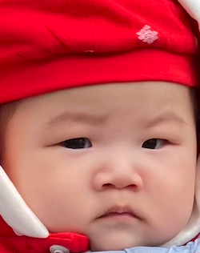
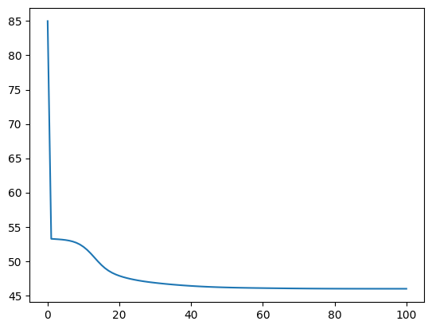

# TuoTuo 
 TuoTuo A Topic Modelling library written in Python. TuoTuo is also a cute boy, my son, who is now 6 months old.  


## Installation 
Use the package manager [pip](https://pip.pypa.io/en/stable/) to install TuoTuo. You may find the Pypi distribution [here](https://pypi.org/project/TuoTuo/).

```bash
pip install TuoTuo --upgrade
```

## Usage 
Currently, the library only supports Topic modeling via Latent Dirichlet Allocation (LDA). As we know, LDA can be implemented using Gibbs Sampling and Variational Inference, we choose the latter as this is mathematically more sophisticated 

- Generate some documents based on pre-defined Dirichlet Parameters over 5 different topics and 40 unique words

```python
from tuotuo.generator import doc_generator 

gen = doc_generator(
    M = 100, 
    # we sample 100 documents 
    L = 20, 
    # each document would contain 20 pre-defined words 
    topic_prior = tr.tensor([1,1,1,1,1], dtype=tr.double)
    # we use a exchangable Dirichlet Distribution as our topic prior, 
    # that is a uniform distribution on 5 topics
)
train_docs = gen.generate_doc()
```

- Form Training Document and train the variational inference parameters in LDA 

```python
from tuotuo.lda_model import LDASmoothed 
import matplotlib.pyplot as plt 

lda = LDASmoothed(
    num_topics = 5, 
)

perplexes = lda.fit(
    train_docs,
    sampling= False,
    verbose=True, 
    return_perplexities=True,
)
plt.plot(perplexes)

=>=>=>=>=>=>=>=>
Topic Dirichlet Prior, Alpha
1

Exchangeable Word Dirichlet Prior, Eta 
1

Var Inf - Word Dirichlet prior, Lambda
(5, 40)

Var Inf - Topic Dirichlet prior, Gamma
(100, 5)

Init perplexity = 84.99592157507153
End perplexity = 45.96696541539976
```



- Check out the top 5 words for each topic according to the variational inference parameter: $\lambda$ 

```python
for topic_index in range(lda._lambda_.shape[0]):

    top5 = np.argsort(lda._lambda_[topic_index,:],)[-5:]
    print(f"Topic {topic_index}")
    for i, idx in enumerate(top5):
        print(f"Top {i+1} -> {lda.train_doc.idx_to_vocab[idx]}")
    print()

=>=>=>=>=>=>=>=>
Topic 0 
Top 1 -> physical
Top 2 -> quantum
Top 3 -> research
Top 4 -> scientst
Top 5 -> astrophysics

Topic 1
Top 1 -> divorce
Top 2 -> attorney
Top 3 -> court
Top 4 -> bankrupt
Top 5 -> contract

Topic 2
Top 1 -> content
Top 2 -> Craftsmanship
Top 3 -> concert
Top 4 -> asymmetrical
Top 5 -> Symmetrical

Topic 3
Top 1 -> recreation
Top 2 -> FIFA
Top 3 -> football
Top 4 -> Olympic
Top 5 -> athletics

Topic 4
Top 1 -> fever
Top 2 -> appetite
Top 3 -> contagious
Top 4 -> decongestant
Top 5 -> injection
```
As we can see from the top 5 words, we can easily realize the following mapping: 

Topic 0 -> science 
Topic 1 -> law 
Topic 2 -> art 
Topic 3 -> sport 
Topic 4 -> health


## Contributing & References

Pull requests are welcome. For major changes, please open an issue first
to discuss what you would like to change.

As there is no mature topic modeling library available, we are also looking for collaborators who would like to contribute in the following directions: 

1. Variational Inference version for batch & online LDA, following the [original LDA Paper by David Blei in 2023][https://www.jmlr.org/papers/volume3/blei03a/blei03a.pdf] and the [Online LDA Paper on NeuraIPs][https://papers.nips.cc/paper_files/paper/2010/file/71f6278d140af599e06ad9bf1ba03cb0-Paper.pdf]. 

Most of the work is completed for this part, we still need to work on:
- computational optimization 
- online LDA implementation 
- efficient Newton's update on priors, namely $\alpha$ and $\eta$ 

2. Extend the library to support neural variational inference Following this [ICML paper: Neural Variational Inference for Text Processing][https://arxiv.org/pdf/1511.06038.pdf]

3. Extend the training to support Reinforcement Learning Following this [ACL paper: Neural Topic Model with Reinforcement Learning][https://aclanthology.org/D19-1350.pdf]

## License

[MIT](https://choosealicense.com/licenses/mit/)